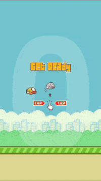
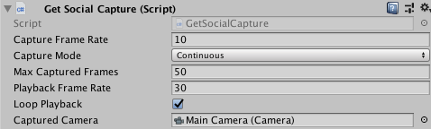
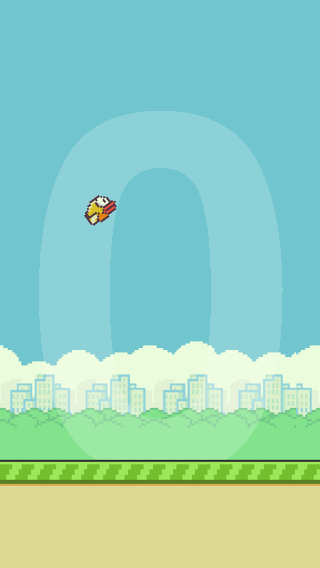
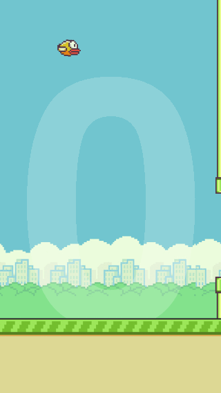
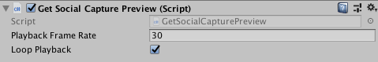
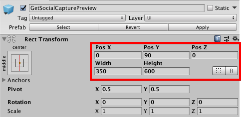

# Introduction

<b>Now with scriptable rendering pipeline support!</b>
The project goal is to let Unity developers record GIFs of gameplay of their game for easy sharing between friends.
After adding asset to your project, you'll have access to all the source codes, feel free to improve it.
If you wonder how to use recorded content, check out our SDK at [https://getsocial.im](https://getsocial.im).



# Integration guide

## Setup

1. Copy `Assets/GetSocialCapture` folder to your project
1. Add `GetSocialCapture` script to any of your Game components.
By default `GetSocialCapture` records Main Camera's rendered content. If you want to change this, set a different Camera instance
to `Captured Camera` variable.
1. If you want to show a preview of the recorded content add `GetSocialCapturePreview` Prefab to any of your screens.
1. You're all set, let's record something. 

## Recording

There are 2 different ways to create a recording, which can be selected using `captureMode` property:
- `Continuous`, when script records camera's content at a rate configured in `captureFrameRate` property and keeps the last `n` frames, specified by `maxCapturedFrames` property.
- `Manual`, when script records camera's content at the time when `CaptureFrame()` method is called. This mode is useful e.g. in puzzle games and for making timelapse videos.

To finish a recording call `StopCapture()` method. Until you start a new session by calling `StartCapture`, the existing recording can be resumed, you only need to call `ResumeCapture`.
When you recorded everything you wanted, call `GenerateCapture` to generate the final `gif` file.

### Example - `Continuous` mode

```
...

public GetSocialCapture capture;

...

// start recording if something interesting happens in the game
void RecordAction() 
{
    capture.StartCapture();
}

// stop recording
void ActionFinished()
{
    capture.StopCapture();
    // generate gif
	capture.GenerateCapture(result =>
	{
        // use gif, like send it to your friends by using GetSocial Sdk
    });
}
```

### Example - `Manual` mode

```
...

public GetSocialCapture capture;

...

void Awake()
{
    ...
    
    // set recording mode to `Manual`
    capture.captureMode = GetSocialCapture.GetSocialCaptureMode.Manual;
}

// start recording if when puzzle level starts
void StartLevel() 
{
    capture.StartCapture();
}

// record the actual screen, like when a piece is moved in puzzle
void RecordStep()
{
    capture.CaptureFrame();
}

// stop recording
void LevelFinished()
{
    capture.StopCapture();
    // generate gif
	Action<byte[]> result = bytes =>
	{
            // generated gif returned as byte[]

	    byte[] gifContent = result.ToArray();

            // use content, like send it to your friends by using GetSocial Sdk
	};  

	capture.GenerateCapture(result);
}
```

### Customization

You configure the recording using the following parameters:



- `captureFrameRate` - Number of captured frames per second.
- `captureMode` - Capture mode, can be `Continuous` or `Manual`.
- `maxCapturedFrames` - Max. number of captured frames during the session.
- `playbackFrameRate` - Number of displayed frames per second.
- `loopPlayback` - Generated gif loops or played only once.

**Hint**

The length of recorded gif can be calculated using the following formula:

```
length = (maxCapturedFrames / captureFrameRate)  * (captureFrameRate  / playbackFrameRate)
```

#### Example - Quick

```
maxCapturedFrames = 50
captureFrameRate = 10
playback = 30
length = 1.5 sec
```




#### Example - Slow

```
maxCapturedFrames = 50
captureFrameRate = 30
playback = 10
length = 5 sec
```



## Preview

If you want to display the recorded content in your game, add `GetSocialCapturePreview` Prefab to any of your screens.
To start playback, call `Play()`, to stop playback call `Stop()`.

### Example

```
...

public GetSocialCapture capture;
public GetSocialCapturePreview capturePreview;

....

// stop recording
void ActionFinished()
{
    capture.StopCapture();
    // show preview
    capturePreview.Play();
}
```

### Customization

You can also customize playback:



- `playbackFrameRate` - Number of displayed frames per second.
- `loopPlayback` - Preview loops or played only once.

The size and position of preview window can be changed in the Editor:




